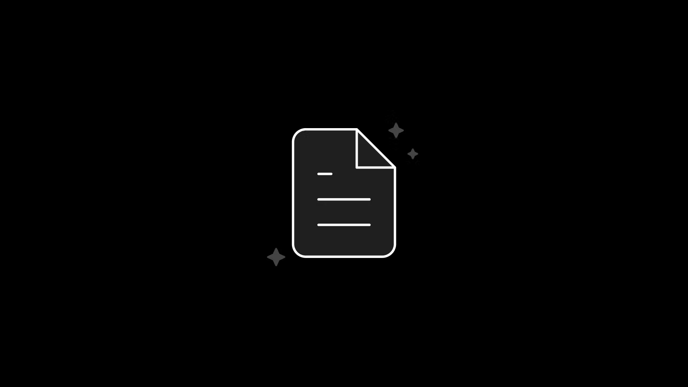

import Callout from 'nextra-theme-docs/callout'
import Bleed from 'nextra-theme-docs/bleed'
import Image from 'next/image'
import Badge from '@components/Badge'
import Alert from '@components/Alert'

# MDX Component

## Badge

```js
import Badge from '@components/Badge'

<Badge>😂 Default</Badge>
<Badge variant="success">Success</Badge>
<Badge variant="warning">Warning</Badge>
<Badge variant="danger">Danger</Badge>
<Badge variant="dark">Dark</Badge>
```
<Badge>😂 Default</Badge>
<Badge variant="success">Success</Badge>
<Badge variant="warning">Warning</Badge>
<Badge variant="danger">Danger</Badge>
<Badge variant="dark">Dark</Badge>

## Alert

```js
import Alert from '@components/Alert'

<Alert>😂 Default</Alert>
<Alert variant="success">Success</Alert>
<Alert variant="warning">Warning</Alert>
<Alert variant="danger">Danger</Alert>
<Alert variant="dark">Dark</Alert>
```
<Alert>😂 Default</Alert>
<Alert variant="success">Success</Alert>
<Alert variant="warning">Warning</Alert>
<Alert variant="danger">Danger</Alert>
<Alert variant="dark">Dark</Alert>

## Heading

```markdown
# **Hello**, This Is a _Title_ Inside `h1`
```

# **Hello**, This Is a _Title_ Inside `h1`

```html
<h2>**Hello**, This Is a _Title_ Inside `h2`</h2>
{/* using html tag to avoid being rendered in the sidebar */}
```

<h2>**Hello**, This Is a _Title_ Inside `h2`</h2>
{/* using html tag to avoid being rendered in the sidebar */}

```markdown
### **Hello**, This Is a _Title_ Inside `h3`
```

### **Hello**, This Is a _Title_ Inside `h3`

```markdown
#### **Hello**, This Is a _Title_ Inside `h4`
```

#### **Hello**, This Is a _Title_ Inside `h4`

```markdown
##### **Hello**, This Is a _Title_ Inside `h5`
```

##### **Hello**, This Is a _Title_ Inside `h5`

```markdown
###### **Hello**, This Is a _Title_ Inside `h6`
```

###### **Hello**, This Is a _Title_ Inside `h6`

## Text

```markdown
With Nextra, all your `.md` and `.mdx` files under the pages directory will be rendered with [MDX](https://mdxjs.com/about), it's an
advanced Markdown format with React component support.
```

With Nextra, all your `.md` and `.mdx` files under the pages directory will be rendered with [MDX](https://mdxjs.com/about), it's an
advanced Markdown format with React component support.

## Text Variant

```markdown
**bold**
```

**bold**

```markdown
**_italicized bold_**
```

**_italicized bold_**

```markdown
_italicized_
```

_italicized_

```markdown
~~strikethrough.~~
```

~~strikethrough.~~

## Emoji ⛺

[Emoji Docs](https://emojipedia.org/) 😂

⚠️ ⛔ ✅ ☑️ ✔️ ❌ 

## Line Separator

```markdown
---
```

---

## Image

**External URL :**

```markdown

```


**Static Image URL :**

If the `demo.png` file is located at `/public/demo.png`, you can use the code below to display it:

```markdown

```


**Static Next/Image :**

You can use [Next.js Image](https://nextjs.org/docs/basic-features/image-optimization) directly in MDX.

If the `demo.png` file is located at `/public/demo.png`, you can use the code below to display it:

```markdown
import Image from 'next/image'

<Image src="/demo.png" alt="Hello" width={500} height={300} />
```

<Image src="/demo.png" alt="Hello" width={500} height={300} />

## Link

```markdown
[MDX](https://mdxjs.com/about), it's an external link
```

[MDX](https://mdxjs.com/about), it's an external link

```markdown
[MDX](https://mdxjs.com/about), it's an internal link
```

[Index](/components), it's an internal link

## List

```markdown
1. one
2. two
3. three
```

1. one
2. two
3. three

```markdown
- one
- two
- three
```

- one
- two
- three

## Task List

```markdown
- [x] Write the press release
- [ ] Update the website
- [ ] Contact the media
```

- [x] Write the press release
- [ ] Update the website
- [ ] Contact the media

## Custom div

```html
<div className="p-4 border border-gray-200 dark:border-gray-900 rounded mt-6">
  Stars on GitHub!
</div>
```

<div className="p-4 border border-gray-200 dark:border-gray-900 rounded mt-6">
  Stars on GitHub!
</div>

## Syntax Highlighting

Automatica syntax highlighting:

````markdown
```js
console.log('hello, world')
```
````

Renders:

```js
console.log('hello, world')
```

You can also add the `highlight=<line|range>` modifier to highlight specific lines:

````markdown
```jsx highlight=4,6-8
import useSWR from 'swr'

function Profile() {
  const { data, error } = useSWR('/api/user', fetcher)

  if (error) return <div>failed to load</div>
  if (!data) return <div>loading...</div>
  return <div>hello {data.name}!</div>
}
```
````

```jsx highlight=4,6-8
import useSWR from 'swr'

function Profile() {
  const { data, error } = useSWR('/api/user', fetcher)

  if (error) return <div>failed to load</div>
  if (!data) return <div>loading...</div>
  return <div>hello {data.name}!</div>
}
```

## Inline Code

```markdown
You can use \`content\` to wrap inline code content like: `let x = 1`.
```

You can use \`content\` to wrap inline code content like: `let x = 1`.

## Blockquote

```markdown
> Where some people measure progress in answers-right per test or tests-passed per year, we are more interested in Sistine-Chapel-Ceilings per Lifetime.
>
> — Alan Kay, A Personal Computer for Children of All Ages
```

> Where some people measure progress in answers-right per test or tests-passed per year, we are more interested in Sistine-Chapel-Ceilings per Lifetime.
>
> — Alan Kay, A Personal Computer for Children of All Ages

Nested quotes:

```markdown
> > Where some people measure progress in answers-right per test or tests-passed per year, we are more interested in Sistine-Chapel-Ceilings per Lifetime.
> >
> > — Alan Kay, A Personal Computer for Children of All Ages
>
> This is **great**.
>
> — Shu Ding.
```

> > Where some people measure progress in answers-right per test or tests-passed per year, we are more interested in Sistine-Chapel-Ceilings per Lifetime.
> >
> > — Alan Kay, A Personal Computer for Children of All Ages
>
> This is **great**.
>
> — Shu Ding.

## Table

```jsx
| Syntax        | Description |   Test Text |
| :------------ | :---------: | ----------: |
| Header        |    Title    | Here's this |
| Paragraph     |    Text     |    And more |
| Strikethrough |             |    ~~Text~~ |
```

| Syntax        | Description |   Test Text |
| :------------ | :---------: | ----------: |
| Header        |    Title    | Here's this |
| Paragraph     |    Text     |    And more |
| Strikethrough |             |    ~~Text~~ |

## React Components

React components and Markdown can be **mixed together**, for instance:

### Default

<Callout emoji="👾">
  **Space Invaders** is a 1978 shoot 'em up arcade game developed by Tomohiro
  Nishikado.
</Callout>

```mdx
import Callout from 'nextra-theme-docs/callout'

<Callout emoji="👾">
  **Space Invaders** is a 1978 shoot 'em up arcade game developed by Tomohiro
  Nishikado.
</Callout>
```

### Warning

<Callout type="warning" emoji="⚠️">
  This API will be deprecated soon.
</Callout>

```mdx
import Callout from 'nextra-theme-docs/callout'

<Callout type="warning" emoji="⚠️">
  This API will be deprecated soon.
</Callout>
```

### Error

<Callout type="error" emoji="🚫">
  This is a dangerous feature that can cause everything to explode.
</Callout>

```mdx
import Callout from 'nextra-theme-docs/callout'

<Callout type="error" emoji="️🚫">
  This is a dangerous feature that can cause everything to explode.
</Callout>
```

```markdown
<Callout>
  Give [**Nextra**](https://github.com/shuding/nextra) a star!
</Callout>
```

Renders:

> <Callout>
>   Give [**Nextra**](https://github.com/shuding/nextra) a star!
> </Callout>

## Callout

You can use import and use React components inside your Markdown files like this:

```markdown
import Callout from 'nextra-theme-docs/callout'

**Markdown With React Components**

<Callout emoji="✅">
  **MDX** (the library), at its core, transforms MDX (the syntax) to JSX.
  It receives an MDX string and outputs a _JSX string_. It does this by parsing
  the MDX document to a syntax tree and then generates a JSX document from that tree. 
</Callout>
```

Generates:

<div className="p-4 border border-gray-200 dark:border-gray-900 rounded mt-6">
**Markdown With React Components**

<Callout emoji="✅">
  **MDX** (the library), at its core, transforms MDX (the syntax) to JSX. It
  receives an MDX string and outputs a _JSX string_. It does this by parsing the
  MDX document to a syntax tree and then generates a JSX document from that
  tree.
</Callout>
</div>

## Bleed

`import Bleed from 'nextra-theme-docs/bleed'`

When wrapping your content with `<Bleed>`, it will be slightly wider than the container
and will overflow on both sides.

<Bleed>
  <div style={{ border: '1px solid #888', padding: '4rem 2.5rem', textAlign: 'center' }}>
    _There is nothing to writing. All you do is sit down at a typewriter and **bleed**._

    — Ernest Hemingway

  </div>
</Bleed>

It provides a better reading experience when you want to present some graphical information, which normally
looks nicer in a larger size.

For example you can put text, image, video or any component inside:

<Bleed>
  <iframe
    width="100%"
    height="430"
    src="https://www.youtube.com/embed/3hccXiXI0u8"
    frameborder="0"
    allow="accelerometer; autoplay; clipboard-write; encrypted-media; gyroscope; picture-in-picture"
    allowfullscreen
  />
</Bleed>

<Bleed>Hey, I can use **Markdown** syntax here.</Bleed>

<Bleed full>
  
</Bleed>

<Bleed full>
  <iframe
    src="https://codesandbox.io/embed/swr-states-4une7"
    width="100%"
    height="500px"
    title="SWR-States"
  ></iframe>
</Bleed>
